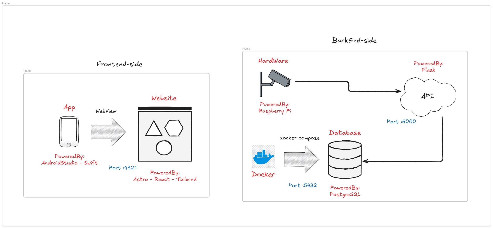
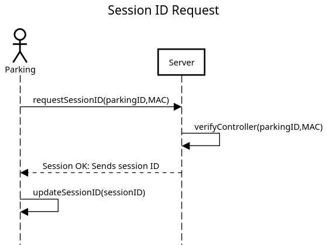
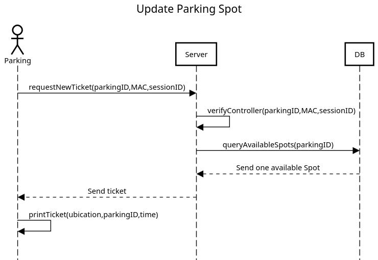
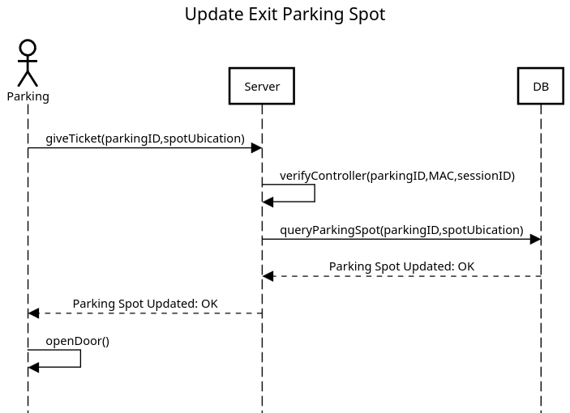

# Parking Manager

This project documents the development and functionality of a **Parking Manager** system. The system is composed of various sensors located at each parking spot and a central server that handles API requests from controllers, web browsers, and mobile applications.

---

## 1. Project Structure

The project consists of three main components:



1. **Parking Sensors**: Installed at parking spots to monitor car entry and exit actions. These sensors communicate with the central server.
2. **REST API**: Manages communication between the sensors, web browsers, mobile applications, and the server. It also updates and retrieves data from the database.
3. **Web and Mobile Applications**: Interface for users to interact with the system and access parking data.

When a car enters or exits the parking lot, sensors send updates (such as door actions) to the REST API, which records the data in the database. Similarly, web browsers and mobile applications make API requests to retrieve parking-related information.

---

## 2. Parking Sensor

The parking sensors perform three primary actions:

### 2.1 Establishing a Session

To ensure communication between the server and sensors, each sensor must establish a session upon connecting to the network. The process involves requesting a session ID from the server. Once the session is successfully established, the sensor uses this ID for all subsequent communications with the server.

- If the server responds with an incorrect session ID during communication, the sensor will terminate the connection and request a new session ID.



#### Default Sensor Configuration:

- **`parking_id`**: `1` - Default parking ID.
- **`MAC`**: `"00:14:22:01:23:45"` - Device MAC address.
- **`session_id`**: `"000000"` - Default session ID.
- **`server_address`**: `"http://172.16.143.120:5000"` - Default server address.
- **`time_created`**: Timestamp when the configuration is initialized.
- **`beam_timeout`**: `3` seconds - Timeout for the break beam sensor.
- **`mode`**: `"entry"` - Default mode for the sensor.

---

### 2.2 Updating Entry Parking Spots

When the entry sensor detects the break beam being blocked for more than **N seconds**, it initiates a ticket request to the server. If the server successfully processes the request, the sensor prints a ticket for the user.



#### Error Handling:

- If an error occurs during communication, the sensor retries the ticket request.
- If the parking lot is full, the entry is denied.

---

### 2.3 Updating Exit Parking Spots

When the exit sensor detects the break beam being blocked for more than **N seconds**, it initiates the exit process. The user is prompted to insert their ticket into the terminal. The server processes the request, and if successful, the door opens to allow the car to exit.



---

### 2.4 Code Structure

The sensor's functionality is implemented across several files:

- **`config.py`**: Handles the creation, loading, and storage of configurations.
- **`beam.py`**: Processes data from the break beam sensors.
- **`logs.py`**: Generates logs for every action registered by the sensor.
- **`api_requests.py`**: Contains functions for making API requests to the server.
- **`main.py`**: Combines all modules to execute the main logic, including session authentication and sensor handling.

---

## 3. REST API Overview

The REST API is the backbone of the HackEps Paeria Parking Management System, facilitating communication between sensors, applications, and the central database. It supports operations such as session management, parking spot allocation, and occupancy prediction.

#### **Base URL**  
`http://172.16.143.120:5000`

#### **Endpoints**

- **`GET /`**: Returns a welcome message confirming server availability.  

- **`POST /get-session-id`**: Establishes a session by generating a unique session ID for parking sensors. This ID is used in subsequent requests to ensure communication continuity.

- **`GET /get-tickets`**: Retrieves details of all active parking tickets, allowing sensors and applications to monitor ticket usage.

- **`GET /get-parkings`**: Returns a list of all available parking lots, enabling applications to display options to users.

- **`GET /get-parking`**: Fetches detailed information about a specific parking lot. The `id` parameter can be used to specify the lot of interest.

- **`POST /add-door-register-entry`**: Registers car entry at a parking lot. Sensors trigger this endpoint to assign a parking spot and issue a ticket. If the parking lot is full, entry is denied.

- **`POST /add-door-register-exit`**: Handles car exits. This endpoint validates the user's ticket, updates parking spot availability, and opens the exit gate.

- **`POST /request-occupation-prediction`**: Provides parking occupancy predictions based on historical and real-time data. Applications use this to inform users about expected availability.

#### **How It Works**

1. **Parking Entry**: When a car enters, sensors detect the event and send a request to `/add-door-register-entry`. The API assigns a parking spot and generates a ticket, which the sensor prints for the user.
2. **Parking Exit**: As a car exits, sensors interact with `/add-door-register-exit`. The API verifies the ticket, updates the parking lot data, and opens the gate for the vehicle to leave.
3. **Occupancy Prediction**: The `/request-occupation-prediction` endpoint leverages historical data to estimate future parking availability, helping users plan effectively.

This REST API streamlines parking management by ensuring seamless data integration, efficient resource allocation, and real-time updates for all system components.

### 3.1 Deployment and Platform Details

The HackEps Paeria Parking Management System is deployed using a containerized setup with **Docker**, ensuring consistency, scalability, and ease of integration. The system comprises two primary components:  

1. **Backend API**: A Flask-based Python server that handles parking operations and connects to a PostgreSQL database.  
2. **Database**: A PostgreSQL 15 instance that stores all parking-related data, such as tickets, parking lots, and historical usage.  

#### **Docker Compose Configuration**

The system is orchestrated using Docker Compose to streamline the deployment of the database. Below is the configuration used:

```yaml
services:
  postgres:
    image: postgres:15
    container_name: hackeps_docker_postgre
    environment:
      POSTGRES_USER: root
      POSTGRES_PASSWORD: hackeps
      POSTGRES_DB: parking_hackeps
    ports:
      - "5432:5432"
    volumes:
      - postgres_data:/var/lib/postgresql/data

volumes:
  postgres_data:
```

- **PostgreSQL Configuration**: The database is configured with a persistent named volume, `postgres_data`, ensuring that data remains intact across container restarts.  
- **Flask API Connectivity**: The Flask application connects to the PostgreSQL container through the provided host and credentials, as defined in the `SQLALCHEMY_DATABASE_URI`.

This platform ensures seamless integration between components and provides a reliable foundation for managing parking operations efficiently.


## 4. ParkingManager Web Application and Mobile Viewer

The **ParkingManager Web Application** provides an intuitive interface for monitoring and managing parking spaces in real-time. Built with modern technologies like **Astro**, **React**, and **TailwindCSS**, the app offers features such as real-time parking availability, map-based navigation, and predictive analytics to enhance the user experience.

### 4.1. **Parking Availability Viewer**
- Displays a list of available parking lots with real-time updates.
- Shows occupancy details, including the number of occupied and total spaces.
- Provides a visual indicator of parking availability (e.g., green for available, red for full).

### 4.2. **Interactive Map with Routing**
- Integrates with **Leaflet** for a responsive map interface.
- Allows users to view parking locations and their details on the map.
- Offers route calculation between the user's current location and the selected parking lot.
- Supports fallback to a test location (e.g., Madrid, Spain) if geolocation is unavailable.

### 4.3. **Predicted Occupancy**
- Utilizes historical data to predict parking lot availability at specific times.
- Displays predictions in a line chart powered by **Chart.js**.
- Helps users plan parking based on expected demand.

### 4.4. **Real-Time Ticket Tracking**
- Fetches and displays active tickets for each parking lot.
- Allows users to monitor parking lot usage dynamically.

### 4.5. **Responsive Carousel**
- A slick, interactive carousel for browsing parking lots.
- Adapts to different screen sizes with seamless transitions.
- Includes custom navigation arrows for improved usability.

### How It Works

#### Parking Availability
1. **Data Fetching**: Parking data is retrieved from the API endpoint `/get-parkings`, which provides a list of parking lots and their current occupancy.
2. **Active Tickets**: Fetches active tickets for each parking lot using `/get-tickets`.
3. **Dynamic Refresh**: Data is refreshed every 10 seconds to ensure up-to-date information.

#### Interactive Map
1. **User Location**: Uses the browser's geolocation API to determine the user's current position.
2. **Parking Location**: Fetches parking location details from the API using `/get-parking`.
3. **Routing**: Calculates the shortest route between the user's location and the selected parking lot using **Leaflet Routing Machine**.

#### Occupancy Predictions
1. **API Integration**: Sends a POST request to `/request-occupation-prediction` with the selected parking lot ID.
2. **Chart Visualization**: Displays predictions in an interactive line chart with time-based labels.

#### Seamless Component Communication
- **State Management**: React's state hooks manage interactions between components, such as selecting a parking lot and displaying its details across the map, ticket tracker, and prediction chart.
- **Prop Passing**: Passes necessary data like `apiUrl` and `selectedParkingId` to child components for streamlined API calls and rendering.

### Mobile Aplication

To create a mobile version of the ParkingManager Web Application, we developed a simple Android WebView application using Android Studio. This app essentially acts as a container for the web-based version of the ParkingManager platform.

### 5. Setup Configuration

To ensure that the **ParkingManager** web application is properly set up and runs in a consistent environment, we use a combination of virtual Python environments and Docker containers. This setup enables us to easily manage dependencies and ensure portability across different machines. The following outlines the key steps involved in configuring the web application and the controller service.

#### 5.1 Virtual Python Environments & Docker Setup

1. **Virtual Python Environment**: 
   We start by creating a virtual Python environment to isolate the project's dependencies from the system's global environment. This ensures that the required libraries are installed specifically for this project, avoiding conflicts with other Python projects.

   - **Activate Virtual Environment**:
     To activate the virtual environment, run the following command:
     ```bash
     source ./venv/bin/activate
     ```

   - **Install Dependencies**:
     Once the virtual environment is active, install all required Python dependencies from the `requirements.txt` file. This file contains a list of Python packages necessary to run the backend Flask API.
     ```bash
     pip install -r requirements.txt
     ```

2. **Docker Container Setup**: 
   To ensure the application runs in a self-contained environment, we use **Docker**. Docker allows us to encapsulate the entire application, including the backend API, Astro frontend, and all dependencies, into a container. This way, the application can be run in any environment without worrying about conflicting system configurations. The setup inside the Docker container ensures consistency and reproducibility.

3. **Flask API**:
   The backend of the application is built using the **Flask** framework. Once the virtual environment is set up and dependencies are installed, the Flask API can be started by running:
   ```bash
   python main.py
   ```

4. **Astro Frontend**:
   The frontend of the application is built using **Astro**, a modern framework for building fast, optimized websites. To start the Astro frontend, we need to install the necessary dependencies and run the development server. First, ensure that the dependencies are installed:
   ```bash
   npm install
   ```
   Then, start the development server with the following command:
   ```bash
   npm run dev -- --host
   ```

   This will start the Astro development server and bind it to the host machine, making the application accessible in the browser for local development.

   **Note**: Be sure to check the `Astro` dependencies to ensure all required packages are properly installed before running the development server.

#### 5.2 Controller Service for Parking Sensors

To manage the **ParkingManager** parking sensors, we configure a **systemd** service on the controller. This service ensures that the parking sensors are automatically executed upon boot. The service runs the necessary sensor processes, such as checking parking availability and reporting back to the Flask API.

1. **Service Configuration**:
   The systemd service is configured to start the sensor scripts on boot. The configuration file for the service is located at `/etc/systemd/system/parking-sensor.service`. It contains settings to ensure the sensors are initialized as soon as the system boots.

2. **Start the Service**:
   To enable and start the service, use the following commands:
   ```bash
   sudo systemctl enable parking-sensor.service
   sudo systemctl start parking-sensor.service
   ```

This ensures that the parking sensors are up and running immediately upon boot, without requiring manual intervention. The service also allows easy management of the sensor processes through systemd commands like `status`, `restart`, and `stop`.